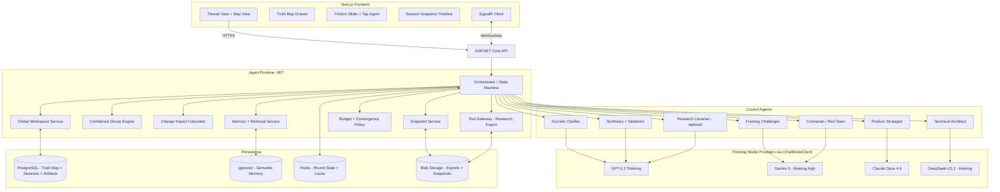

# Agon Architecture (Living Strategy Room)

**Version:** 2.0

---

## 1) High-Level Topology

| Layer | Technology |
|---|---|
| Frontend | Next.js (App Router) + Tailwind + shadcn/ui primitives + Framer Motion |
| Realtime | SignalR (streaming tokens + Truth Map state events) |
| Backend | ASP.NET Core (.NET) |
| Orchestration | Microsoft Agent Framework |
| Persistence | PostgreSQL (sessions, artifacts, Truth Map), pgvector (semantic memory), Redis (ephemeral round state, locks, rate limits), Blob storage (exports) |

---

## 2) Core Runtime Responsibilities

### 2.1 Orchestrator (Deterministic State Machine)

The Orchestrator owns the session state machine. It is the **only** component that decides policy transitions. LLM outputs cannot trigger state transitions directly — they can only propose Truth Map patches.

Responsibilities:
- Enforce round limits, budget limits, convergence thresholds, and friction-level policy.
- Schedule agent calls and tool calls.
- Validate and apply `TruthMapPatch` operations (schema validation, conflict resolution, provenance tagging).
- Run the **Confidence Decay Engine** after each round.
- Run the **Change Impact Calculator** when a constraint or assumption changes mid-session.
- Write immutable **round snapshots** to the snapshot store for Pause-and-Replay.
- Broadcast Truth Map updates and convergence score deltas via SignalR.

### 2.2 Global Workspace Service ("Truth Map")

Manages the structured session state.

- Stores Truth Map as JSONB + normalised entity tables with `derived_from` and `challenged_by` relationship columns.
- Maintains append-only `truth_map_events` log (full audit trail of every patch operation).
- Exposes:
  - `ApplyPatch(sessionId, patch)` — validates, applies, and broadcasts.
  - `GetImpactSet(entityId)` — returns all downstream entities derived from the given entity (used for change propagation).
  - `GetSnapshot(sessionId, roundId)` — returns an immutable snapshot for Pause-and-Replay.

### 2.3 Confidence Decay Engine

Runs as a post-round pass inside the Orchestrator.

Algorithm per claim:
1. If the claim was challenged by the Contrarian this round AND no other agent defended it → apply decay: `confidence -= decay_step` (default 0.15).
2. If new evidence was added to Truth Map with `supports` referencing this claim → apply boost: `confidence += boost_step` (default 0.10).
3. Clamp confidence to `[0.0, 1.0]`.
4. If `confidence < contested_threshold` (default 0.3) → mark claim status as **Contested**; notify Orchestrator.
5. Write confidence transition events to the patch log.

### 2.4 Change Impact Calculator

Runs when a constraint, assumption, or decision changes mid-session (HITL or system-triggered).

1. Traverse the `derived_from` graph starting from the changed entity.
2. Return the complete set of downstream claims, risks, and assumptions.
3. Orchestrator marks affected entities as **Pending Revalidation**.
4. Orchestrator schedules targeted micro-round tasks for affected agents only.
5. After micro-round responses, patches are applied and convergence recalculated.

### 2.5 Snapshot Service

- Writes an immutable JSON snapshot of the full Truth Map at the end of each round.
- Snapshots are content-addressed (hash of Truth Map state) and stored in the session record.
- Exposes `ForkSession(sessionId, snapshotId, patches)` — creates a new session branched from the given snapshot with the specified initial patches applied.

### 2.6 Memory / Retrieval Service

- Embedding pipeline (runs on Truth Map entity text and agent messages).
- Semantic retrieval: top-K memories injected into each agent call's context.
- Supports natural-language queries: "what did we decide about stack?", "find unresolved risks", "show contested claims".

### 2.7 Streaming Service (SignalR)

Streams the following event types to the frontend:
- Partial agent tokens (streaming output)
- Round progress events (phase transitions)
- Truth Map patch events (entity add/update/remove)
- Confidence transition events (claim confidence changes)
- Convergence score updates (per-dimension and overall)
- Pending Revalidation notifications (when change propagation triggers)

---

## 3) Mermaid Diagram



---

## 4) Data Model Overview

### 4.1 Session

```
session_id        UUID PK
user_id           UUID FK
mode              enum: quick | deep
friction_level    int (0-100)
status            enum: active | paused | complete | forked
forked_from       UUID FK nullable (parent session if this is a fork)
fork_snapshot_id  UUID FK nullable
created_at        timestamp
updated_at        timestamp
```

### 4.2 Truth Map

```
truth_map_current     JSONB            — live state
truth_map_events      append-only log  — full patch history with agent + round provenance
truth_map_snapshots   immutable blobs  — one per round end, stored in Blob with hash reference in PG
truth_map_entities    normalised rows  — claims, risks, assumptions with derived_from + challenged_by FK columns
```

### 4.3 Entity Link Table

```
entity_id       UUID PK
session_id      UUID FK
entity_type     enum: claim | assumption | risk | decision | evidence
text            text
confidence      float nullable (claims only)
status          enum: active | contested | pending_revalidation | resolved
agent_id        varchar
round_created   int
derived_from    UUID[] — array of entity_id references
challenged_by   UUID[] — array of entity_id references
```

### 4.4 Artifacts

```
artifact_id     UUID PK
session_id      UUID FK
artifact_type   enum: verdict | plan | prd | risks | assumptions | copilot | architecture | scenario_diff
content         text (Markdown)
version         int
created_at      timestamp
```

---

## 5) Key Engineering Choices

### 5.1 Truth Map as source of truth (not the transcript)

The conversation transcript is stored as provenance/evidence only. The Truth Map is the authoritative record. Artifacts are generated from the Truth Map, not from the transcript.

### 5.2 Patch-based updates with provenance

Every state change is expressed as a `TruthMapPatch` operation log entry. Every patch carries:
- `agent` — which agent proposed it
- `round` — which round it was applied in
- `reason` — human-readable rationale

The Orchestrator validates patches before applying them. Invalid patches are rejected and the agent is notified.

### 5.3 Derived-from graph enables targeted invalidation

Because every entity carries `derived_from` references, the Change Impact Calculator can cheaply compute the downstream blast radius of any change without scanning the entire Truth Map. This is what makes targeted reevaluation (rather than full re-runs) feasible.

### 5.4 Immutable snapshots enable Pause-and-Replay

Round-end snapshots are content-addressed and immutable. Forking a session creates a new session record branched from a snapshot, with a specified set of initial patches applied before the debate resumes. Both branches persist independently for diffing.

### 5.5 Dynamic model routing (not hardwired personalities)

Agents have a primary model assignment but the Orchestrator can route sub-tasks (patch formatting, clarifying question generation, summarisation) to cheaper models. The `IChatModelClient` interface makes providers interchangeable. All calls pass: `max_output_tokens`, `reasoning_mode: high`, and trace metadata (`session_id`, `agent_id`, `round_id`).

### 5.6 Research tools are optional

If enabled, the Research Librarian fetches evidence and stores it with full metadata in the Truth Map. Evidence is linked to claims via `evidence.supports`. If disabled, all external claims are marked "unverified" and the evidence_quality convergence dimension is capped at 0.6.

---

## 6) API Surface (Key Endpoints)

```
POST   /sessions                          — create session
GET    /sessions/{id}                     — get session state
POST   /sessions/{id}/start               — begin clarification phase
POST   /sessions/{id}/hitl/challenge      — HITL: challenge a specific claim
POST   /sessions/{id}/hitl/constraint     — HITL: add/modify a constraint (triggers change propagation)
POST   /sessions/{id}/hitl/deepdive       — HITL: force targeted deep dive on a claim
POST   /sessions/{id}/messages            — user message (clarification response or post-delivery question)
GET    /sessions/{id}/snapshots           — list available round snapshots
POST   /sessions/{id}/fork                — create a forked session from a snapshot
GET    /sessions/{id}/artifacts           — list generated artifacts
GET    /sessions/{id}/artifacts/{type}    — retrieve a specific artifact
GET    /sessions/{id}/truthmap            — get current Truth Map state
WS     /hubs/debate                       — SignalR hub (all streaming events)
```

---

## 7) Frontend–Backend Communication Patterns

The frontend communicates with the backend via two channels: **REST API (HTTPS)** for commands and queries, and **SignalR (WebSockets)** for real-time streaming. They serve different purposes and must not be mixed.

### 7.1 REST API (HTTPS) — Commands and Queries

All user-initiated actions and data fetches use standard REST calls:

| Action | Method | Endpoint | Notes |
|---|---|---|---|
| Create session | `POST` | `/sessions` | Returns session ID |
| Start debate | `POST` | `/sessions/{id}/start` | Kicks off clarification phase |
| Submit clarification response | `POST` | `/sessions/{id}/messages` | User answers to Socratic Clarifier |
| Challenge a claim (HITL) | `POST` | `/sessions/{id}/hitl/challenge` | Targets a specific claim by entity ID |
| Add/modify constraint (HITL) | `POST` | `/sessions/{id}/hitl/constraint` | Triggers change propagation |
| Force deep dive (HITL) | `POST` | `/sessions/{id}/hitl/deepdive` | Scoped micro-round on a specific entity |
| Post-delivery question | `POST` | `/sessions/{id}/messages` | Routed to relevant agent |
| Get Truth Map | `GET` | `/sessions/{id}/truthmap` | Full current state |
| Get artifacts | `GET` | `/sessions/{id}/artifacts/{type}` | Retrieve generated output |
| Fork session | `POST` | `/sessions/{id}/fork` | Creates branch from snapshot |

REST calls are fire-and-forget from the frontend's perspective — the response confirms the action was accepted. The actual results (agent responses, patch updates) arrive via SignalR.

### 7.2 SignalR (WebSockets) — Real-Time Streaming

The frontend connects to the `/hubs/debate` SignalR hub when a session is active. All real-time updates are **server-pushed** — the frontend never polls.

| Event Type | Payload | When it fires |
|---|---|---|
| `AgentTokens` | `{ agentId, token, isComplete }` | Streaming partial agent output (token by token) |
| `RoundProgress` | `{ phase, status }` | Phase transitions (e.g., CLARIFICATION → DEBATE_ROUND_1) |
| `TruthMapPatch` | `{ patch, version }` | After a validated patch is applied to the Truth Map |
| `ConfidenceTransition` | `{ claimId, oldConfidence, newConfidence, reason }` | After Confidence Decay Engine runs |
| `ConvergenceUpdate` | `{ dimensions, overall }` | After convergence scores are recalculated |
| `PendingRevalidation` | `{ entityIds[] }` | When change propagation marks entities for re-evaluation |
| `ArtifactReady` | `{ artifactType, version }` | When an artifact is generated or regenerated |
| `BudgetWarning` | `{ percentUsed, message }` | At 80% and 95% budget thresholds |

### 7.3 Key Rules

- **REST for intent, SignalR for results.** The frontend sends user actions via REST. It receives all system updates (agent output, Truth Map changes, phase transitions) via SignalR. Never poll REST endpoints to check for updates.
- **Optimistic UI is not used.** Truth Map state in the UI is updated only when a `TruthMapPatch` event arrives from the server (confirming the patch was validated and applied). The UI shows a streaming/pending indicator until the event arrives.
- **Connection resilience.** If the SignalR connection drops, the frontend must reconnect and re-fetch the current Truth Map state via `GET /sessions/{id}/truthmap` to resync, then resume listening for events.
